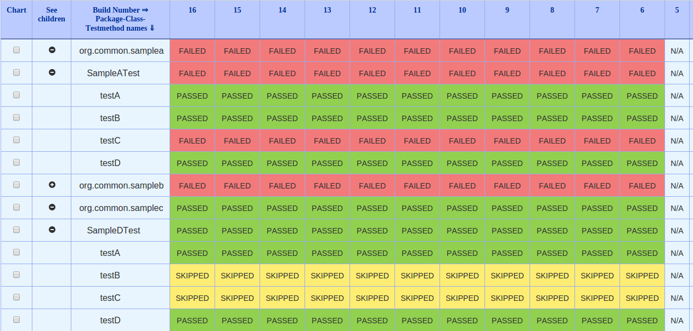
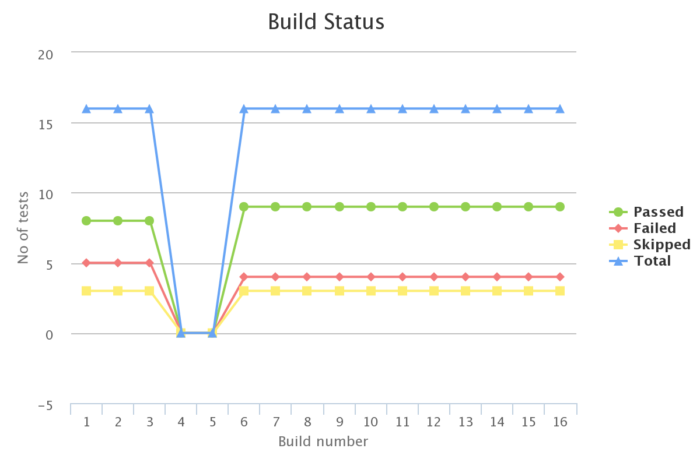
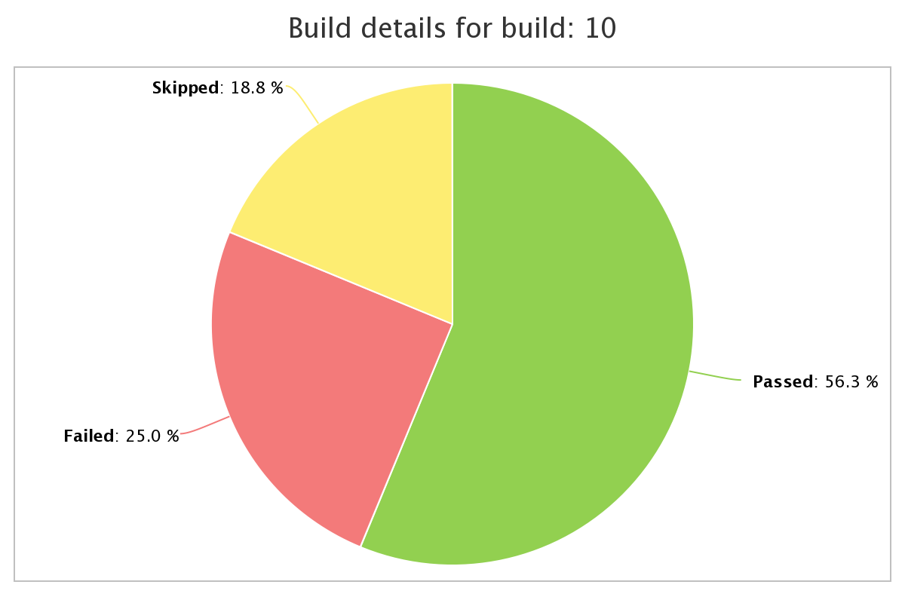

## test-results-analyzer

- A plugin that shows history of test execution results in a tabular format.
- The results are shown in a tree grid hierarchy and user has the provision to drill-down to test-method level to see the execution status of the respective set across multiple builds.

## About

While executing our tests on Jenkins many of time test fails on
particular builds. Now if you want to check that when a particular
test-case, test-class or a test-package has failed you may need to go to
each and every build report and check for the result.

This process is very cumbersome and may take a lot of time to get the
report. The said plugin solves the said issue by showing the build
result history of test-class, test-class and test-package in a tabular
tree format. The plugin can be used enabling the "Publish junit results"
or "Publish TestNG results"(in case of TestNG) feature of Jenkins.

It allows users to filter the results based on passed, failed and
skipped status. 

Once installed you can just click on the "Test Results Analyzer" link on
the left hand side of your job, as shown in the following image:

Following is a sample image of the report:

 

## Graphs

We all know the importance of the graphical report for our test
execution as it gives us a clear picture of the execution. The said
plugin also supports generation of Graphs for the test execution from
0.2.0 version onwards.

# Following charts are available 

## Line Charts
 
  

##  Pie Charts
  

## Bar Charts
  

**Note**: **If you click on any point on the line chart it will generate
a pie chart for said build/point.**

## Change Log
**[Changelog](./CHANGELOG.md)**

## License
[**Apache-2.0 license**](https://www.apache.org/licenses/LICENSE-2.0)