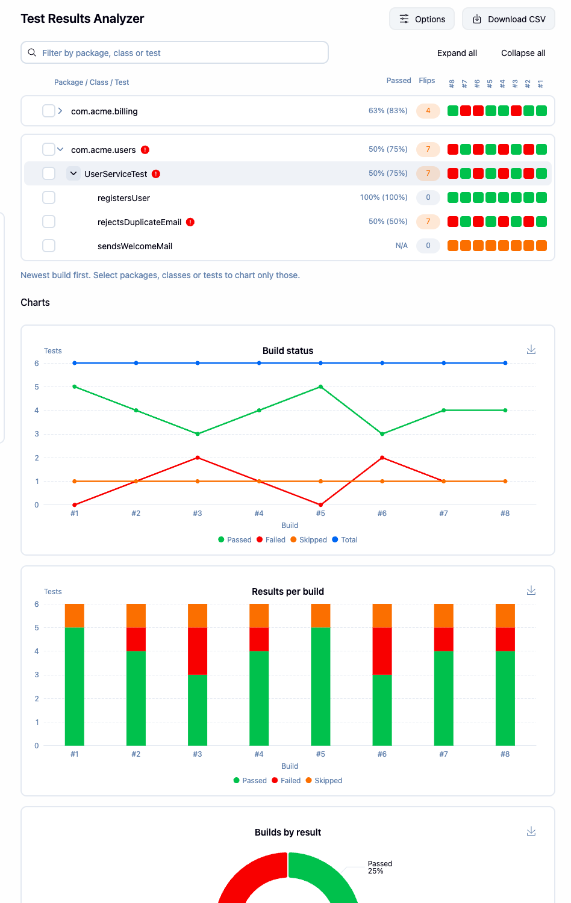
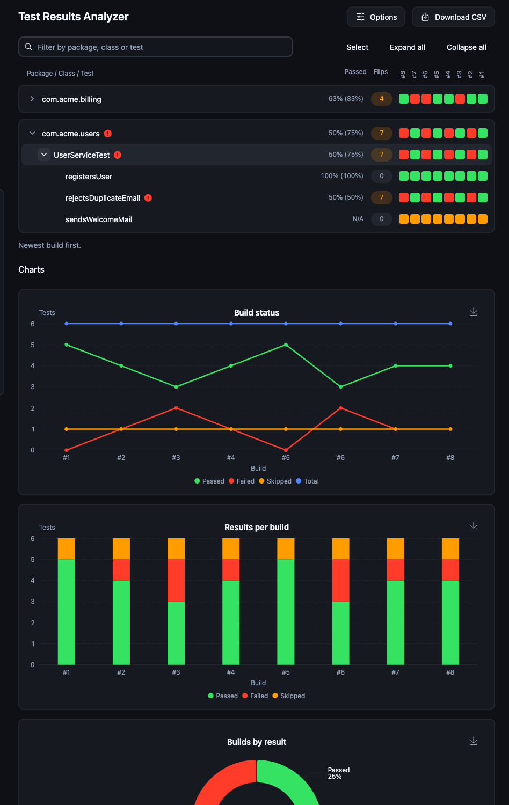

# [Test Results Analyzer](https://plugins.jenkins.io/test-results-analyzer/)

Shows the history of your test results across builds, so you can see when a package, class or
test started failing, how often it flips between passing and failing, and which tests break most.

## About

When a test fails it is usually not enough to know that it failed in the latest build: you want to
know whether it is a new failure, whether it is flaky, and how long it has been like that.
Finding that out by opening every build's test report is slow.

The analyzer collects the results published by "Publish JUnit test result report" (or the TestNG
plugin) and shows them in one place. Open it from the **Test Results Analyzer** link in a job's
side panel.



- **History**: one card per package. Expand a package to see its classes and tests. Each row has a
  strip of squares, one per build with the newest first, coloured by result. Click a square to open
  that build. Rows also show how often the item passed and how many times it switched between
  passing and failing. A red marker flags a test that passed in the previous build and fails now.
- **Filter**: type part of a package, class or test name to narrow the list.
- **Charts**: line, stacked bar and pie charts of passes and failures per build, the pass rate,
  or test run times. Click **Select** and tick packages, classes or tests to chart only those. Click a build on the line chart to show it in the
  pie chart. Each chart can be saved as an image.
- **Most broken tests**: the tests that failed most often, with links to the builds they failed in.
- **Download CSV**: exports every test for the builds shown, ignoring the filter and display options.

Use **Options** to change the number of builds, or choose **Specific builds** and list build numbers
and ranges such as `12, 36, 40-53` to compare those builds. Options can also show run times instead
of results, show tests that did not run in the builds shown, show only the tests whose status differs
between the builds, hide TestNG configuration methods, change how many most broken tests are listed,
or pick which charts to draw. Defaults, run-time thresholds, custom status
names and custom status colours are set under *Manage Jenkins › System › Test Results Analyzer*.

The page follows the Jenkins theme, including dark mode, and adapts to small screens.



## REST API

The data behind the page can be fetched by scripts. Both endpoints live under the job's analyzer
URL, take a `GET`, and need *Job › Read* on the job. Authenticate with a user's
[API token](https://www.jenkins.io/doc/book/using/remote-access-api/); no crumb is needed.

| Endpoint | Returns |
|----------|---------|
| `job/<job>/test_results_analyzer/data` | The test history as JSON |
| `job/<job>/test_results_analyzer/csv`  | The same history as CSV, as downloaded by **Download CSV** |

For a job in a folder, use the job's full URL, for example `job/<folder>/job/<job>/test_results_analyzer/data`.

Parameters:

- `builds`: how many of the latest completed builds to include. Leave it out, or pass `-1`, for all
  of them (limited by *No. of Runs To Fetch Reports* in the global configuration).
- `buildNumbers`: build numbers and ranges to include instead of the latest builds, such as
  `12,36,40-53` (at most 10,000 builds). `builds` is ignored when it is given. Builds that do not
  exist or are still running are left out; an invalid list is answered with a `400`.
- `hideConfigMethods` (`data` only): `true` leaves out TestNG configuration methods.
- `durations` (`csv` only): `true` exports run times in seconds instead of results.

```sh
curl -u "$USER:$API_TOKEN" "$JENKINS_URL/job/my-job/test_results_analyzer/data?builds=10"
curl -u "$USER:$API_TOKEN" -o test-results.csv "$JENKINS_URL/job/my-job/test_results_analyzer/csv?builds=10"
curl -u "$USER:$API_TOKEN" "$JENKINS_URL/job/my-job/test_results_analyzer/data?buildNumbers=12,36,40-53"
```

The JSON has the build numbers, newest first, and a tree of packages, classes and tests. Every
node has one `buildResults` entry per build, in the same order as `builds`:

```json
{
  "builds": ["2", "1"],
  "results": [
    {
      "text": "com.example",
      "buildResults": [ ... ],
      "children": [
        {
          "text": "CalculatorTest",
          "buildResults": [ ... ],
          "children": [
            {
              "text": "testAdd",
              "buildResults": [
                {
                  "buildNumber": "2",
                  "totalTests": 1,
                  "totalFailed": 1,
                  "totalPassed": 0,
                  "totalSkipped": 0,
                  "totalTimeTaken": 0.25,
                  "status": "FAILED",
                  "url": "https://jenkins.example.com/job/my-job/2/testReport/com.example/CalculatorTest/testAdd"
                },
                { "buildNumber": "1", "status": "N/A" }
              ],
              "children": []
            }
          ]
        }
      ]
    }
  ]
}
```

- `status` is `PASSED`, `FAILED` (failures and errors), `SKIPPED` or `N/A`. `N/A` means the item did
  not run in that build, and its entry has no other fields.
- The `total*` counts are of the tests below the node; for a test they are 0 or 1.
- `totalTimeTaken` is in seconds.
- `url` links to the test report of that build. It is absolute when the Jenkins URL is configured.

The CSV has the columns `Package`, `Class`, `Test`, then one column per build number, newest first.
Its cells use the custom status names when they are configured.

## Development

The analyzer page is a React and TypeScript app in `src/main/frontend`, built by Vite into
`src/main/webapp/js/bundles`. Maven installs Node and builds it, so `mvn hpi:run` and
`mvn verify` work as usual; `mvn verify` also runs the Biome, TypeScript and Vitest checks.

While working on the page, run `npm run build:dev` next to `mvn hpi:run` to rebuild on save, and
`npm run test:dev` to run the Vitest specs on save. `npm run format` and `npm run biome:fix` fix
formatting and lint findings.

## Change Log
**[Changelog](./CHANGELOG.md)**


## License
[**Apache-2.0 license**](https://www.apache.org/licenses/LICENSE-2.0)


## Report an Issue
Please report issues and enhancements through the
[Jenkins issue tracker](https://www.jenkins.io/participate/report-issue/redirect/#19327).